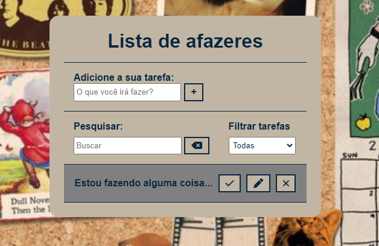

# TO-DO LIST Project 📝

Project for practicing a To-do List, created using HTML, JavaScript, and CSS.
It can be used as a inspiration or a basis for other productivity projects.
Ideal for those who want study FrontEnd concepts.

## OnLine Demonstration

Access the project website hosted on GitHub Pages:
()

## Features

- Add new tasks
- Mark tasks as completed
- Edit tasks
- Remove tasks
- Filter tasks 
- Search for tasks
- Responsive and modern layout

## Screenshot ✨

![Screenshot of what the To-Do List looks like.]

  

